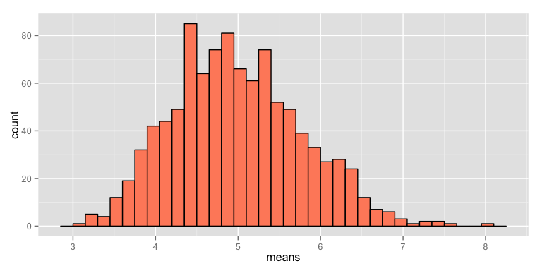
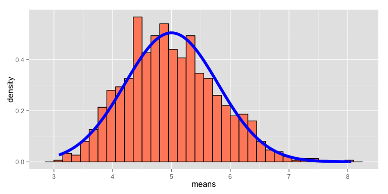

# Statistical Inference Course Project 1
Ben White  
26 July 2015  


The aim of this project is to investigate the exponential distribution and the Central Limit Theorem in R. The exponential distibution is simulated using `rexp(n, lambda)` where $n$ the number of results, and lambda is the rate parameter. The mean $\mu$ and standard deviation $\sigma$ are both 1/lambda. 

## Simulations


Set the constants


```r
lambda <- 0.2 
n <- 40 
noSimulations <- 1000 
```

Set the seed so that the test can be reproduced


```r
set.seed(1)
```

Run the 1000 simulations using rexp


```r
simulationResults <- matrix(data=rexp(n * noSimulations, lambda), nrow=noSimulations)
simulationMeans <- data.frame(means=rowMeans(simulationResults))
```

Plot of the Means


```r
g <- ggplot(data = simulationMeans, aes(x = means))  
g <- g + geom_histogram(fill = "salmon1",
                        binwidth = 0.15,
                        color = "black") 
g
```

 

## Question 1. Sample Mean versus Theoretical Mean

The mean $\mu$ of a exponential distribution is:

$\mu= \frac{1}{\lambda}$ 


```r
mu <- 1/lambda
mu
```

```
## [1] 5
```

The mean of the sample means is as follows:


```r
meanOfMeans <- mean(simulationMeans$means)
meanOfMeans
```

```
## [1] 4.990025
```

It can be seen the theoretical mean of 5 and the mean of the sample means 4.9900252 are close.

## Question 2. Sample Variance versus Theoretical Variance

The expected standard deviation $\sigma$ is:

$\sigma = \frac{1/\lambda}{\sqrt{n}}$ 


```r
sigma <- 1/lambda/sqrt(n)
sigma
```

```
## [1] 0.7905694
```

The variance $Var$ is the standard deviation $\sigma$ squared:

$Var = \sigma^2$ 


```r
sigma2 <- sigma^2
sigma2
```

```
## [1] 0.625
```

Calculating the standard deviation and variances of the simulations


```r
sdOfSimulation <- sd(simulationMeans$means)
sdOfSimulation
```

```
## [1] 0.7859435
```

```r
varOfSimulation <- var(simulationMeans$means)
varOfSimulation
```

```
## [1] 0.6177072
```

## Q3. Show the distribution is approximately normally distributed


```r
g <- ggplot(data = simulationMeans,
            aes(x = means)) 
g <- g + geom_histogram(aes(y = ..density..),
                        fill = "salmon1", 
                        binwidth = 0.15,
                        color = "black")
g <- g + stat_function(fun = dnorm,
                       arg = list(mean = mu , sd = sigma),
                       colour = "blue",
                       size = 2)
g
```

 

As the graph shows the distribution of the sample means is approximately normally distributed.
