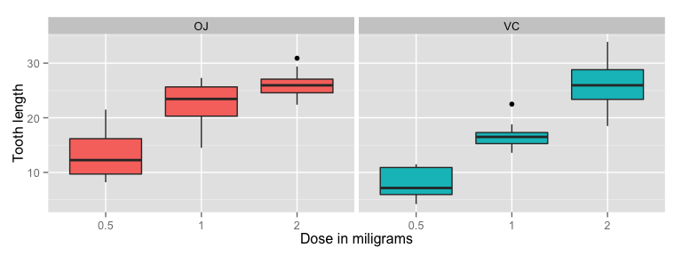

# Statistical Inference Course Project 2
Ben White  
26 July 2015  


The aim of this part of the project is to analyse the `ToothGrowth` dataset. The dataset shows the length of the teeth under a dose of Vitamin C at 3 different levels (0.5, 1 and 2 mg) with two delivery methods (orange juice or ascorbic
acid). Ten guinea pigs were in each group so there were 60 observations in total.

##Exploratory Data Analysis and Data Summary


```r
library(datasets)
summary(ToothGrowth)
```

```
##       len        supp         dose      
##  Min.   : 4.20   OJ:30   Min.   :0.500  
##  1st Qu.:13.07   VC:30   1st Qu.:0.500  
##  Median :19.25           Median :1.000  
##  Mean   :18.81           Mean   :1.167  
##  3rd Qu.:25.27           3rd Qu.:2.000  
##  Max.   :33.90           Max.   :2.000
```

A simple figure comparing the different groups.


```r
library(ggplot2)
g <- ggplot(data=ToothGrowth, aes(x=as.factor(dose),
                                  y=len, fill=supp))
g <- g + geom_boxplot() + 
    facet_grid(. ~ supp) + 
    xlab("Dose in miligrams") + 
    ylab("Tooth length") + 
    guides(fill=FALSE)
g
```

 

It's clear from that as the dose increases the length of tooth increases.

##Statistical Inference: Comparing tooth growth by dose and supplement

###Supplement Type

As the observations of each dosage and method are few; 10 per scenario, the Student t-Test has been used. Assuming the variance to be unequal in all cases.

t-Test of group differences by supplement type assuming that the variances are unequal. Checking if the `p value>0.05` and the confidence interval contains 0.


```r
t.test(len ~ supp, data = ToothGrowth)
```

```
## 
## 	Welch Two Sample t-test
## 
## data:  len by supp
## t = 1.9153, df = 55.309, p-value = 0.06063
## alternative hypothesis: true difference in means is not equal to 0
## 95 percent confidence interval:
##  -0.1710156  7.5710156
## sample estimates:
## mean in group OJ mean in group VC 
##         20.66333         16.96333
```

As the p-value of this test is > 0.05, testing at the 95% significance level there is  not enough evidence to reject the null hypothesis; that the means of delivery has an effect on tooth length

###Dosage

Testing the effect of increasing from dosage 0.05mg to 1mg to see if it has a positive effect on tooth length.


```r
t.test(ToothGrowth$len[ToothGrowth$dose==1], ToothGrowth$len[ToothGrowth$dose==0.5], paired = FALSE, var.equal = TRUE)
```

```
## 
## 	Two Sample t-test
## 
## data:  ToothGrowth$len[ToothGrowth$dose == 1] and ToothGrowth$len[ToothGrowth$dose == 0.5]
## t = 6.4766, df = 38, p-value = 1.266e-07
## alternative hypothesis: true difference in means is not equal to 0
## 95 percent confidence interval:
##   6.276252 11.983748
## sample estimates:
## mean of x mean of y 
##    19.735    10.605
```

There is enough evidence to reject the null hypothesis, which subsequently means that it can be assumed that the dosage change from 0.5mg to 1mg causes tooth length to increase


```r
t.test(ToothGrowth$len[ToothGrowth$dose==2], ToothGrowth$len[ToothGrowth$dose==1], paired = FALSE, var.equal = TRUE)
```

```
## 
## 	Two Sample t-test
## 
## data:  ToothGrowth$len[ToothGrowth$dose == 2] and ToothGrowth$len[ToothGrowth$dose == 1]
## t = 4.9005, df = 38, p-value = 1.811e-05
## alternative hypothesis: true difference in means is not equal to 0
## 95 percent confidence interval:
##  3.735613 8.994387
## sample estimates:
## mean of x mean of y 
##    26.100    19.735
```

There is enough evidence to reject the null hypothesis, which subsequently means that it can be assumed that the dosage change from 1mg to 2mg causes tooth length to increase.


```r
t.test(ToothGrowth$len[ToothGrowth$dose==2], ToothGrowth$len[ToothGrowth$dose==0.5], paired = FALSE, var.equal = TRUE)
```

```
## 
## 	Two Sample t-test
## 
## data:  ToothGrowth$len[ToothGrowth$dose == 2] and ToothGrowth$len[ToothGrowth$dose == 0.5]
## t = 11.799, df = 38, p-value = 2.838e-14
## alternative hypothesis: true difference in means is not equal to 0
## 95 percent confidence interval:
##  12.83648 18.15352
## sample estimates:
## mean of x mean of y 
##    26.100    10.605
```

There is enough evidence to reject the null hypothesis, which subsequently means that it can be assumed that the dosage change from 0.5mg to 2mg causes tooth length to increase.

As would be expected with the hypothesis that increasing the dosage of Vitamin C increases the tooth length, the confidence interval with the lowest p value was the 0.5mg vs 2.0mg test

##Conclusion

1. Vitamin C delivery has no effect on tooth length in guinea pigs.
2. Increasing the dosage of Vitamin C causes an increase in the tooth length in guinea pigs.

##Assumptions

1. The guinea pigs were chosen for each scenario independently and at random from the  population.
2. The sample population of 60 guinea pigs is an accurate representation of the wider guinea pig population
3. Variances were assummed to be unequal accross the sample groups when carrying out the t-Test.
